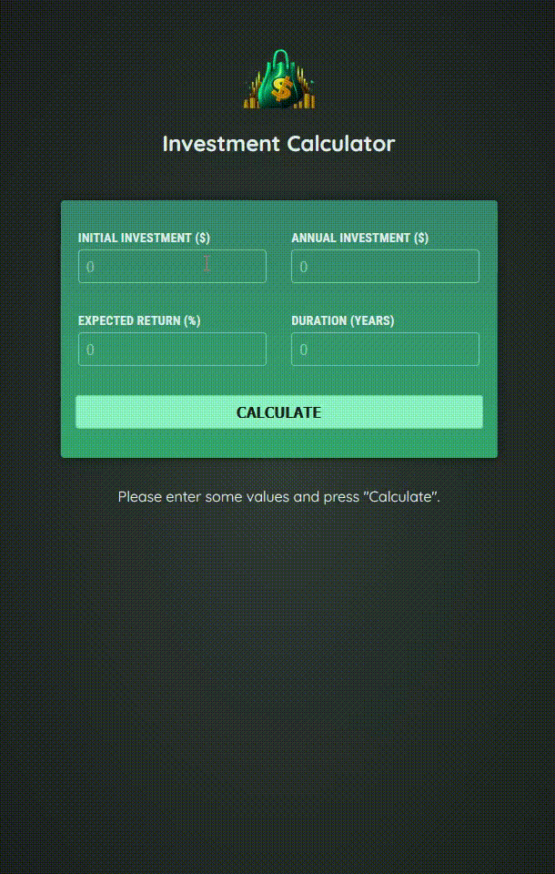

# Investment Calculator 💰

Este é um projeto desenvolvido em Angular que funciona como uma calculadora de investimentos. Ele permite que você insira informações financeiras básicas e com base nos dados fornecidos retorna uma tabela detalhada com a projeção dos seus investimentos ao longo dos anos.

## 📋 Funcionalidades

**Previsão de Investimentos:** Com base no investimento inicial, aportes anuais, taxa de retorno esperada e duração, o sistema calcula:

- Valor total do investimento ao longo dos anos.
- Retorno anual e total de investimento.
- Capital investido.

**Interface intuitiva:** A aplicação possui um design amigável e responsivo, tornando fácil a visualização das projeções.

## 📝 Notas

- A calculadora utiliza juros compostos para calcular o retorno dos investimentos.
- Os cálculos são apenas previsões e não garantem resultados reais.
- Esta aplicação foi feita para fins educativos e ilustrativos.
